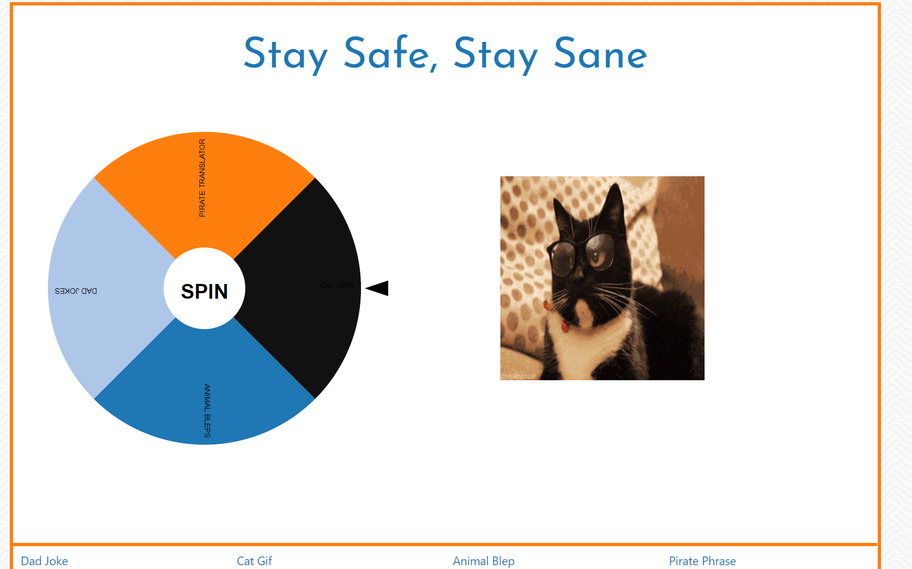

<!-- PROJECT SHIELDS -->

[![Contributors][contributors-shield]][contributors-url] [![Forks][forks-shield]][forks-url] [![Stargazers][stars-shield]][stars-url] [![Issues][issues-shield]][issues-url] 

 
<h3 align="center">Stay Safe, Stay Sane</h3>
<p align="center">
A lighthearted random fun generator to entertain people in these trying times. The user can spin a wheel that will return a dad joke, a cat gif, etc.
The user can also enter a phrase to be translated into pirate speech.
<br />
<br />
<a href="https://celupanow.github.io/ssss">View Demo</a>
·
<a href="https://github.com/celupanow/ssss/issues">Report Bug</a>
·
<a href="https://github.com/celupanow/ssss/issues">Request Feature</a>

</p>

</p>
<!-- TABLE OF CONTENTS -->

## Table of Contents

* [About the Project](#about-the-project)
	* [Built With](#built-with)
* [Getting Started](#getting-started)
	* [Prerequisites](#prerequisites)
	* [Installation](#installation)
* [Roadmap](#roadmap)
* [Contact](#contact)
* [Acknowledgements](#acknowledgements)

  
  
  

<!-- ABOUT THE PROJECT -->

## About The Project


### Built With
* [HTML](https://developer.mozilla.org/en-US/docs/Learn/HTML)
* [CSS](https://developer.mozilla.org/en-US/docs/Web/CSS)
* [Materialize](https://getbootstrap.com/)
* [JavaScript](https://developer.mozilla.org/en-US/docs/Web/JavaScript)
* [jQuery](https://jquery.com)
* [AJAX](https://developer.mozilla.org/en-US/docs/Web/Guide/AJAX)
* [Animal Blep API](https://mlem.tech/api/randommlem)
* [Dad Jokes API](https://icanhazdadjoke.com)
* [Giphy API](https://developers.giphy.com/)
* [Pirate Translator API](https://piratespeak.p.rapidapi.com)

<!-- GETTING STARTED -->

## Getting Started
To get a local copy up and running follow these simple steps.
  
### Installation

1. Clone the repo

```sh

git clone https://github.com/celupanow/ssss.git

```
2. Open the index.html pages in your browser.

<!-- ROADMAP -->

## Roadmap

  

See the [open issues](https://github.com/celupanow/ssss/issues) for a list of proposed features (and known issues).

<!-- CONTACT -->

## Contact

  

  

Project Link: [https://github.com/celupanow/ssss](https://github.com/celupanow/ssss)

<!-- ACKNOWLEDGEMENTS -->

## Acknowledgements

  

* [GitHub Pages](https://pages.github.com)

## Team Members

 - Alex Jarvis
 - Christina Lupanow
 - Justin Lambeth
 - Shianne Taylor

<!-- MARKDOWN LINKS & IMAGES -->

<!-- https://www.markdownguide.org/basic-syntax/#reference-style-links -->

[contributors-shield]: https://img.shields.io/github/contributors/celupanow/ssss.svg?style=flat-square

[contributors-url]: https://github.com/celupanow/ssss/graphs/contributors

[forks-shield]: https://img.shields.io/github/forks/celupanow/ssss.svg?style=flat-square

[forks-url]: https://github.com/celupanow/ssss/network/members

[stars-shield]: https://img.shields.io/github/stars/celupanow/ssss.svg?style=flat-square

[stars-url]: https://github.com/celupanow/ssss/stargazers

[issues-shield]: https://img.shields.io/github/issues/celupanow/ssss.svg?style=flat-square

[issues-url]: https://github.com/celupanow/ssss/issues

[license-shield]: https://img.shields.io/github/license/celupanow/ssss.svg?style=flat-square

[license-url]: https://github.com/celupanow/ssss/blob/master/LICENSE.txt

[linkedin-shield]: https://img.shields.io/badge/-LinkedIn-black.svg?style=flat-square&logo=linkedin&colorB=555

[linkedin-url]: https://linkedin.com/in/celupanow

[product-screenshot]: images/screenshot.png
<!--stackedit_data:
eyJoaXN0b3J5IjpbLTU3ODA4NDYwOV19
-->